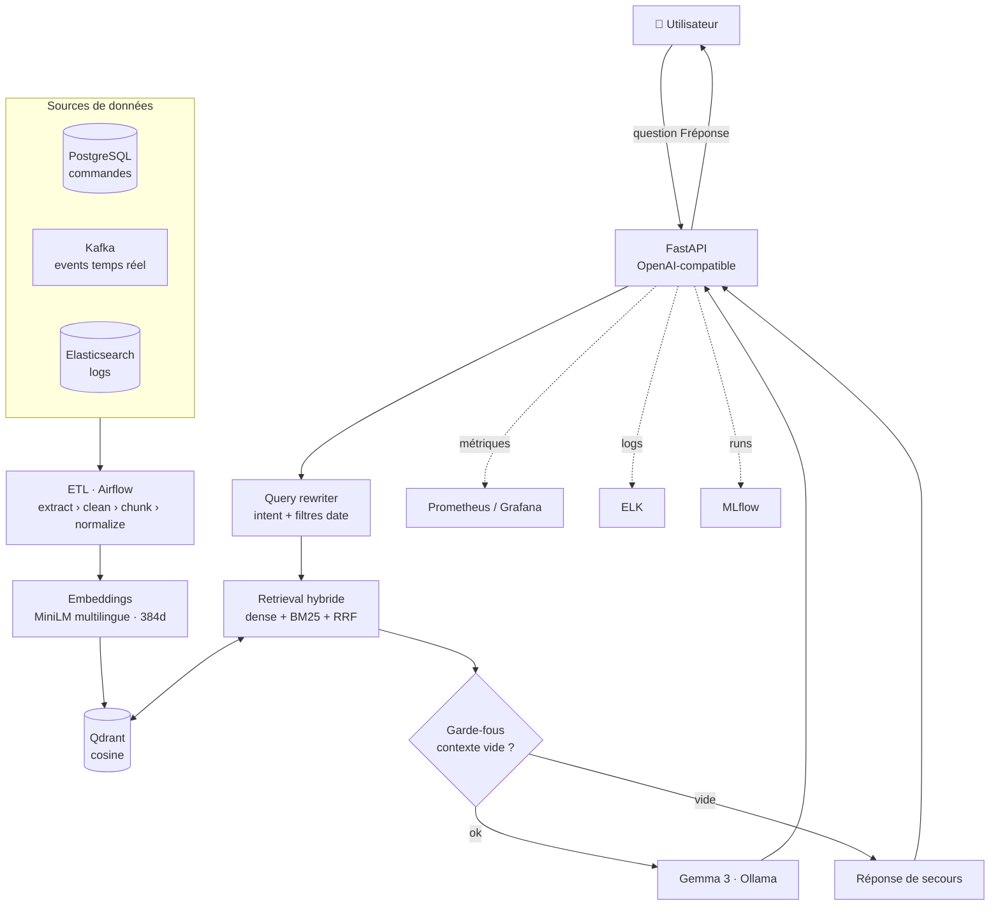

# 🚚 MLOps RAG Delivery


> **Assistant RAG** (Retrieval-Augmented Generation) qui supervise **en langage naturel** une plateforme de livraison de repas — de l'ingestion temps réel jusqu'à l'évaluation automatisée, une chaîne **MLOps de bout en bout**.

📍 *Projet de Fin d'Études — ENSTICP 2025*

---

## 💬 Ce que ça fait

On pose une question en français, l'assistant répond à partir des données **réelles** de la plateforme (commandes, livreurs, incidents, métriques) :

> « **Quel est l'état de la plateforme aujourd'hui ?** »
> « **Y a-t-il des incidents en cours ?** »
> « **Quelles commandes sont en retard en ce moment ?** »
> « **Donne-moi un résumé des dernières 24h** »

Le tout via une **API compatible OpenAI**, branchable directement sur [Open WebUI](https://github.com/open-webui/open-webui) pour une expérience de chat.

## ✨ Points forts

- 🔎 **Retrieval hybride** — dense (embeddings) + lexical (BM25) fusionnés par *Reciprocal Rank Fusion*
- 🧠 **LLM 100 % local** — Gemma 3 via Ollama : aucune dépendance cloud, données souveraines
- 🛡️ **Garde-fous anti-hallucination** — réponse de secours si le contexte récupéré est vide
- ✍️ **Query rewriting** — détection d'intention et de filtres temporels avant la recherche
- 🔄 **ETL orchestré** (Airflow) sur **3 sources** — PostgreSQL, Kafka (temps réel), Elasticsearch
- 🔐 **Sécurité API** — authentification JWT + RBAC, audit, rate-limiting
- ⚡ **Cache Redis** des embeddings de questions pour réduire la latence
- 📊 **Évaluation RAGAS** — *faithfulness*, *answer relevancy*, *context precision/recall*
- 📈 **Observabilité complète** — Prometheus + Grafana, logs ELK, suivi d'expériences MLflow
- ✅ **CI/CD** GitHub Actions — **222 tests** unitaires, couverture **~78 %**, images Docker → GHCR

## 🔁 Cycle MLOps (CI · CD · CT)

Le projet matérialise les trois piliers MLOps, chacun outillé par un workflow GitHub Actions :

| Pilier | Workflow | Rôle |
|--------|----------|------|
| **CI** — *Continuous Integration* | `ci.yml` | Lint + tests unitaires & couverture (≥ 70 %) + tests d'intégration |
| **CD** — *Continuous Delivery* | `cd.yml` | Build & push des images Docker `api` / `simulator` vers GHCR |
| **CT** — *Continuous Training* | `ct.yml` | Ré-ingestion + ré-évaluation périodique du pipeline RAG (embeddings → Qdrant → retrieval) ; éval qualité approfondie via RAGAS + suivi MLflow |

## 🏗️ Architecture



## 🧰 Stack technique

| Composant            | Technologie                                   |
|----------------------|-----------------------------------------------|
| LLM                  | Gemma 3 (Ollama, CPU-only)                    |
| Vector Store         | Qdrant (384 dim, Cosine)                      |
| Embedding            | `paraphrase-multilingual-MiniLM-L12-v2`       |
| Retrieval            | Hybride dense + BM25 + RRF                    |
| API                  | FastAPI (routes compatibles OpenAI) + JWT     |
| Orchestration ETL    | Apache Airflow                                |
| Streaming            | Kafka (simulateur d'events livraison)         |
| Cache                | Redis                                         |
| Évaluation RAG       | RAGAS                                         |
| Monitoring           | Prometheus + Grafana                          |
| Logs                 | ELK Stack (Elasticsearch · Logstash · Kibana) |
| Suivi MLOps          | MLflow                                        |
| Conteneurisation     | Docker Compose (18 services)                  |

## 🚀 Démarrage rapide

```bash
git clone https://github.com/MED-Feriel/mlops-rag-delivery.git
cd mlops-rag-delivery
cp .env.example .env

make up        # Démarre tous les services (Docker Compose)
make generate  # Génère les données PostgreSQL
make simulate  # Lance le simulateur Kafka (events temps réel)
make query     # Teste le pipeline RAG
```

Puis ouvre le **chat** sur <http://localhost:3001> ou la **doc API** sur <http://localhost:8080/docs>.

## 🖥️ Interfaces disponibles

| Service        | URL                              | Identifiants |
|----------------|----------------------------------|--------------|
| Chat (Open WebUI) | <http://localhost:3001>       | —            |
| API RAG (docs) | <http://localhost:8080/docs>     | —            |
| Qdrant UI      | <http://localhost:6333/dashboard>| —            |
| Airflow        | <http://localhost:8081>          | admin/admin  |
| MLflow         | <http://localhost:5000>          | —            |
| Grafana        | <http://localhost:3000>          | admin/admin  |
| Kibana         | <http://localhost:5601>          | —            |

## 🧪 Qualité & tests

```bash
pytest tests/unit/ -v        # 222 tests unitaires
pytest tests/integration/ -v # tests d'intégration (services Docker)
```

La CI applique à chaque push : **lint** (flake8 + black), **tests unitaires**, **seuil de couverture ≥ 70 %** (~78 % actuellement) et **tests d'intégration**.

## 📊 Évaluation RAGAS

La qualité des réponses est mesurée avec [RAGAS](https://github.com/explodinggradients/ragas) via `scripts/run_ragas_eval.py`, avec des seuils de gate :

| Métrique          | Seuil   |
|-------------------|---------|
| Faithfulness      | ≥ 0.65  |
| Answer Relevancy  | ≥ 0.60  |
| Context Precision | suivi   |
| Context Recall    | suivi   |

> L'évaluation s'exécute **à la demande** (`workflow_dispatch`) : RAGAS nécessite un Qdrant peuplé et un LLM joignables, indisponibles sur les runners GitHub-hosted.

## 🗂️ Structure du projet

```
src/
├── api/            # Endpoints FastAPI, routes OpenAI-compatible, JWT/RBAC, audit
├── embeddings/     # Embedder MiniLM multilingue (+ cache Redis)
├── evaluation/     # Pipeline de scoring RAGAS
├── ingestion/      # ETL : extract / clean / chunk / normalize
├── llm/            # Client Gemma 3 (Ollama)
├── monitoring/     # Métriques Prometheus, tracker MLflow, versioning
├── rag/            # Pipeline RAG complet (rewrite → retrieve → guardrails → generate)
├── retrieval/      # Retrieval hybride Qdrant + BM25
├── simulator/      # Producteur Kafka (events livraison)
└── vector_store/   # Wrapper Qdrant
```

## ⚙️ CI/CD

Workflows GitHub Actions (`.github/workflows/`) :

| Workflow               | Déclencheur                              | Rôle                                                                 |
|------------------------|------------------------------------------|---------------------------------------------------------------------|
| `ci.yml`               | push (toutes branches), PR vers `main`   | Lint + tests unitaires & couverture (≥ 70 %) + tests d'intégration   |
| `cd.yml`               | push sur `main`                          | Build & push des images Docker `api` / `simulator` vers `ghcr.io`    |
| `model_validation.yml` | manuel (`workflow_dispatch`)             | Évaluation RAGAS (à lancer quand une infra d'éval est disponible)    |

L'authentification GHCR utilise le **`GITHUB_TOKEN`** automatique (permission `packages: write`) — aucun PAT à configurer. Pour publier une image versionnée, inclure `release vX.Y.Z` dans le message de commit poussé sur `main` : la CD taguera `api` et `simulator` avec `vX.Y.Z` en plus de `latest` et du SHA.

---

<p align="center"><sub>Projet de Fin d'Études — ENSTICP 2025 · RAG · MLOps · Observabilité</sub></p>
