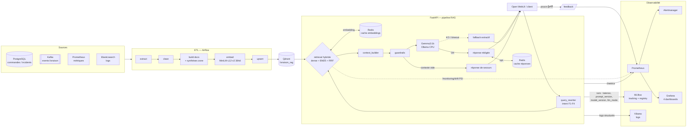

# Architecture — mlops-rag-delivery (v2.0.0)

## Stack
- Vector Store : **Qdrant** (collection `livraison_rag`, 384 dim, distance Cosine)
- LLM : **Gemma3:1b** via Ollama
- Embedding : `paraphrase-multilingual-MiniLM-L12-v2` (sentence-transformers 2.5.1)
- RAG : LangChain 0.1.9
- Évaluation : **RAGAS 0.1.7** (faithfulness, answer_relevancy, context_precision, context_recall)
- Streaming : Kafka 7.5.0
- Orchestration : Airflow 2.9.0
- Observabilité : ELK 8.12.0 + Prometheus + Grafana
- API : FastAPI 0.110.0
- MLOps : MLflow 2.10.0

## Conteneurs
- `simulator` (port 8090) — léger : faker / asyncpg / kafka / httpx
- `api` (port 8080) — lourd : langchain / sentence-transformers / ragas
- ETL — moyen : kafka / qdrant-client / sentence-transformers

## Flux RAG
1. ETL extrait depuis PostgreSQL + Kafka
2. clean → normalize → document_builder → chunk → embedder → Qdrant
3. /query : embed question → retrieve top_k → build context → Gemma3:1b
4. /query/stream : pareil mais SSE
5. Évaluation RAGAS quotidienne via DAG Airflow → MLflow

---

## Schéma détaillé (caches, feedback, résilience, alerting)

### Flux d'une requête `/query`
1. **cache réponses** (B.2, optionnel, OFF par défaut) — hit → retour immédiat sans retrieve ni LLM.
2. **query_rewriter** — intent F1 retards / F2 incidents / F3 restaurants / F4 zones → filtres + dates.
3. **retrieval hybride** — dense (Qdrant) + sparse (BM25) fusionnés par RRF ; l'embedding passe par le **cache Redis** (B.1).
4. **context_builder** + **guardrails** : contexte vide → réponse de secours sans LLM (anti-hallucination).
5. **génération** Gemma3:1b. Ollama KO → **fallback extractif** (C.8) au lieu d'une 500.
6. **MLflow** : latences, `prompt_version`/`prompt_sha` (C.5), `model_version`, `llm_mode`.

### Composants ajoutés (cette itération)
| Domaine | Élément | Endpoint / métrique |
|---------|---------|---------------------|
| Santé | Health embedding | `GET /health/embedding` |
| Cache | Invalidation ciblée | `DELETE /cache/invalidate?query=` |
| Cache | Cache de réponses (opt.) | `rag_answer_cache_{hits,misses}_total` |
| Feedback | Pouce 👍/👎 | `POST /feedback`, `GET /feedback/stats`, `rag_feedback_total{rating}` |
| Résilience | Fallback sans LLM | `rag_llm_fallback_total` |
| MLflow | Versioning de prompt | `GET /prompt/version` |
| Drift | PSI distribution Qdrant | `GET /monitoring/drift`, `rag_data_drift_psi{field}` |
| Alerting | Alertmanager + 3 règles | service `:9093` |
| Ops | Restauration modèle offline | `scripts/restore_embedding.sh` |

## Roadmap (infra-dépendant)

### C.6 — Dashboard Grafana des DAGs Airflow
Airflow n'expose pas Prometheus nativement. Deux options :
- **StatsD → statsd_exporter → Prometheus** (prod) : `AIRFLOW__METRICS__STATSD_ON=true`
  + service `statsd_exporter` scrapé par Prometheus, puis dashboard Grafana
  (durée DAG, taux d'échec, retards de planification).
- **Exporter léger** : petit service interrogeant l'API REST Airflow
  (`/api/v1/dags/.../dagRuns`) → gauges `airflow_dag_last_state` /
  `airflow_dag_duration_seconds`. Moins d'infra, suffisant pour la soutenance.

### C.9 — Tests A/B
Faisable : Ollama héberge déjà `gemma3:1b` et `gemma3:4b`. Esquisse :
- **Split déterministe** : `variant = "B" if hash(question) % 100 < N else "A"`
  (affectation stable par question, N = % vers le candidat).
- **Service** : A = modèle Production (registry), B = candidat (modèle ou prompt).
- **Mesure** : tag MLflow `ab_variant` + label Prometheus sur latence/feedback ;
  comparer satisfaction et latence par variante.
- **Décision** : promotion du candidat via le Model Registry s'il gagne.
