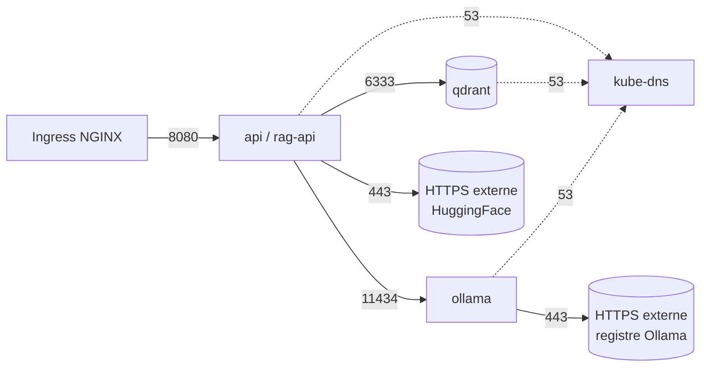

# Architecture réseau Kubernetes — RAG Platform (MLOPS-120)

Micro-segmentation du namespace `rag-livraison` par NetworkPolicies, sur le
modèle **deny-by-default + autorisations ciblées**.

> **Adaptation vs ticket** : le périmètre k8s déployé (voir `k8s/`) ne contient
> que `api`, `qdrant`, `ollama` (pas postgres/kafka/redis/mlflow). Les policies
> ont donc été adaptées à ces 3 services et au namespace `rag-livraison`.

## Topologie autorisée



Tout le reste est **refusé** (ex: qdrant→internet, accès direct externe à
qdrant/ollama, pod→pod non listé).

## Policies

| Fichier | Cible | Effet |
|---------|-------|-------|
| `00-default-deny` | tous | refuse tout ingress + egress |
| `01-allow-dns` | tous | autorise l'egress DNS (kube-dns 53) |
| `02-api-ingress` | rag-api | ingress seulement depuis `ingress-nginx` :8080 |
| `03-api-egress` | rag-api | egress vers qdrant:6333, ollama:11434, HTTPS externe |
| `04-qdrant-isolation` | qdrant | ingress seulement depuis l'API :6333 (isolée) |
| `05-ollama-isolation` | ollama | ingress depuis l'API :11434 + egress HTTPS (pull modèle) |

## Déploiement

```bash
kubectl apply -f k8s/network-policies/
kubectl get networkpolicies -n rag-livraison
```

## Tests des restrictions

```bash
# API → Qdrant : doit RÉUSSIR
kubectl exec -n rag-livraison deploy/api -- nc -zv qdrant 6333

# API → Ollama : doit RÉUSSIR
kubectl exec -n rag-livraison deploy/api -- nc -zv ollama 11434

# Qdrant → Internet : doit ÉCHOUER (egress refusé)
kubectl exec -n rag-livraison deploy/qdrant -- timeout 3 wget -q -O- https://example.com || echo "Egress bloqué ✓"
```

## Prérequis & limites

- **CNI** : les NetworkPolicies ne sont appliquées que par un CNI qui les
  supporte (Calico, Cilium, Weave). Le **flannel** par défaut de k3s/minikube
  ne les applique pas → installer Calico/Cilium pour qu'elles aient un effet.
- **Probes kubelet** : selon le CNI, les sondes liveness/readiness venant du
  nœud peuvent être bloquées par le deny-by-default. Si les pods restent
  `NotReady`, ajouter une règle d'ingress autorisant le CIDR des nœuds sur le
  port de la sonde (ex: 8080 pour l'API), ou configurer l'exception au niveau
  du CNI (Calico `FelixConfiguration`).
- **Services non déployés** : si postgres/kafka/redis/mlflow sont ajoutés plus
  tard, créer les policies d'isolation correspondantes (ingress depuis l'API
  uniquement) sur le même modèle.
